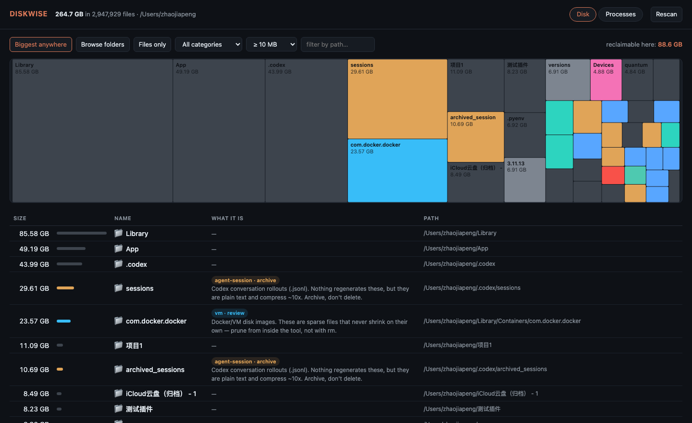
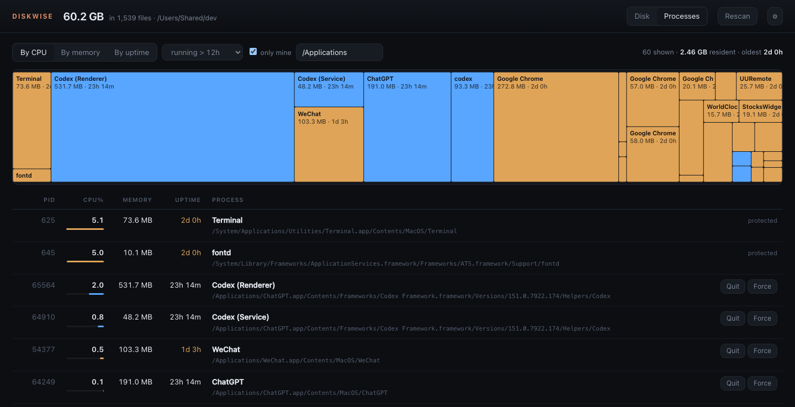

# diskwise

A disk and process browser for macOS that knows what your AI coding agents left behind.

`du` tells you `~/.codex` is 44 GB. It does not tell you that 30 GB of that is
conversation transcripts that compress ten to one, that another 770 MB is a
plugin cache which re-downloads itself, or that the last month of it is still
in active use and must not be touched. diskwise does.



## Why

This started because a laptop hit 93% full and the owner had no idea why. The
answer, in order:

| | |
|---|---|
| `~/.codex/sessions` | 29.6 GB — 1,555 conversation rollouts, average 18 MB each |
| `~/Library/Containers/com.docker.docker` | 23.6 GB — a disk image that never shrinks on its own |
| `~/.codex/archived_sessions` | 10.7 GB |
| `~/.claude/projects` | 1.9 GB — Claude Code transcripts |
| `.claude-mem`, `.claude-science`, `.grok`, `.copilot`, `.alphacouncil-agent` | ~9 GB combined |

None of these tools prune anything. Every generic disk visualiser shows them as
anonymous folders. The point of diskwise is the layer that names them.

## Install

```sh
cargo install --git https://github.com/Zhao73/diskwise
```

Or grab a binary from [Releases](../../releases) — `aarch64` and `x86_64`.

To see all of `~/Library`, give your terminal Full Disk Access in
System Settings → Privacy & Security. diskwise reports how many paths it could
not read rather than silently under-counting.

## Use

```sh
diskwise ui                    # the visual browser, on http://127.0.0.1:7373
diskwise scan ~ --top 30       # same ranking, in the terminal
diskwise scan ~/.codex --shallow          # browse one folder, files and all
diskwise scan ~ --files --min 500M        # individual files only
diskwise scan ~ --category build          # just build output
diskwise ps --days 3 --by-mem             # what has been running for days
```

Cleaning is a two-step, always:

```sh
diskwise clean ~ --archives --target 50G  # prints a plan, changes nothing
diskwise confirm 1787929776               # you run this, and only then
```

```sh
diskwise archive ~/.codex/sessions/2026/06   # tar.zst, verified, then Trash
diskwise archives                            # what has been archived
diskwise restore ~/.diskwise/archives/codex-sessions-2026-06-20260828-1509.tar.zst
```

## Processes

The same window shows what is running: CPU share, resident memory, and — the
one nobody else surfaces — how long it has been running. Agent helpers that
have been up for six days holding 500 MB are easy to find and easy to stop.
Hovering anything on either chart gives you the name, the full path, and the
full command line.



System-owned and session-critical processes are shown but never offered for
termination.

## Use it from Claude Code or Codex

diskwise speaks MCP over stdio, so an agent can answer "why is my disk full"
with real numbers instead of guesses.

```sh
claude mcp add diskwise -- diskwise mcp
```

Codex — in `~/.codex/config.toml`:

```toml
[mcp_servers.diskwise]
command = "diskwise"
args = ["mcp"]
```

Ten tools: `top_offenders`, `explain_path`, `plan_cleanup`, `apply_cleanup`,
`archive_path`, `list_archives`, `restore_archive`, `list_processes`,
`kill_process`, `policy`.

**An agent cannot delete your files on its own.** `apply_cleanup` returns the
plan and the command *you* have to run:

```json
{
  "applied": false,
  "reason": "needs confirmation: run `diskwise confirm <plan-id>`",
  "would_free_bytes": 14378465280,
  "user_must_run": "diskwise confirm 1787929776"
}
```

That refusal is enforced in `policy.rs`, tested in `mcp.rs`, and is the default
with no configuration at all.

## Safety model

Two layers, and they are not the same thing.

**Hard-coded, not configurable.** `~/.ssh`, `~/.gnupg`, `~/Library/Keychains`,
iCloud Drive, iOS backups, every `.git` directory, `/System`, `/Library`,
`/usr`. No policy file can switch these off; a test asserts it using the most
permissive configuration a user could write.

**Yours to set,** in `~/.diskwise/policy.toml` (see `policy.example.toml`):

```toml
default = "confirm"        # readonly | confirm | auto
auto_allow = ["~/Library/Caches/**", "**/node_modules"]
max_auto_delete_gb = 5.0
```

Beyond that:

- Deletions go to the **Trash**, never `rm`.
- Archives are **read back in full and verified before** the original is
  released. An archive nobody has read is not a backup.
- Retention windows are enforced **per file**, so a directory holding both live
  and stale data gives up only the stale half.
- Sizes come from allocated blocks, not apparent size, so they match `du` on
  APFS where clones and sparse files lie.

## Performance, honestly

A 3-million-file home directory scans in ~35 seconds and peaks around 850 MB
of RSS while it does, because the walker allocates an entry per file. The
finished index is about 90 MB of that, and the rest is returned when the scan
ends. `diskwise ui` serves the page immediately and scans in the background,
so a cold start is never a blank browser window.

## Rules

The interesting part of this project is `rules/default.toml` — plain data, no
Rust:

```toml
[[rule]]
id = "codex-sessions"
match = ["~/.codex/sessions", "~/.codex/archived_sessions"]
category = "agent-session"
regenerable = false
suggest = "archive"
retain_days = 30
note = "Codex conversation rollouts (.jsonl). Nothing regenerates these, but they are plain text and compress ~10x. Archive, don't delete."
```

`suggest` is one of `archive` (irreplaceable but compressible), `trash`
(regenerable), `review` (only you can judge), `never` (protected).

**Know a tool that hoards disk space? Add a rule and open a PR.** That is the
easiest useful contribution to this repo, and it does not require knowing Rust.

## Development

```sh
cargo test          # 23 tests, including real archive round-trips
cargo clippy --all-targets -- -D warnings
```

MIT.
